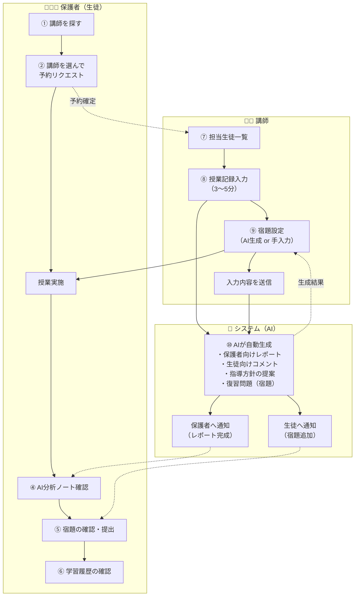
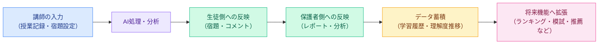
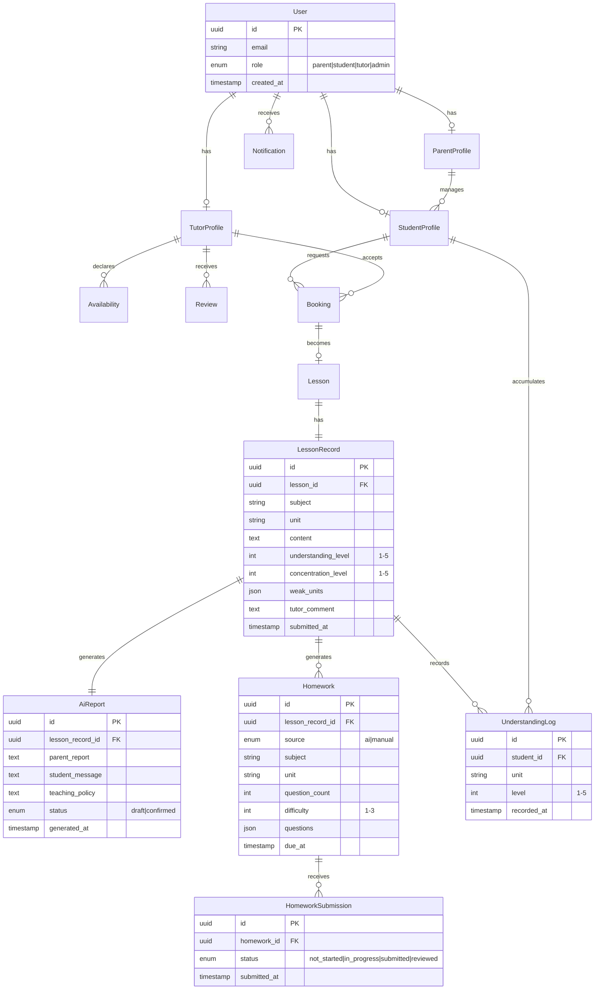

<div align="center">


# manaby

**AI 家庭教師アプリ — 授業の価値を最大化し、学習の習慣化を支援する**

家庭教師の授業価値を AI で高め、**保護者・生徒・講師の 3 者全員**がメリットを感じられることを実証する MVP。


</div>

---

## 目次

- [1. プロジェクト概要](#1-プロジェクト概要)
- [2. スコープ定義](#2-スコープ定義)
- [3. ユーザーロール](#3-ユーザーロール)
- [4. 機能要件](#4-機能要件)
- [5. サービス全体フロー](#5-サービス全体フロー)
- [6. 画面一覧](#6-画面一覧)
- [7. AI 分析ノート仕様](#7-ai-分析ノート仕様)
- [8. データフローとデータモデル](#8-データフローとデータモデル)
- [9. 技術スタック](#9-技術スタック)
- [10. 非機能要件](#10-非機能要件)
- [11. 成功指標（KPI）](#11-成功指標kpi)
- [12. セットアップ](#12-セットアップ)
- [13. ディレクトリ構成](#13-ディレクトリ構成)
- [14. ロードマップ](#14-ロードマップ)
- [ライセンス](#ライセンス)

---

## 1. プロジェクト概要

### 1.1 背景と目的

従来の家庭教師サービスでは、授業の中で起きたこと（何を学び、どこでつまずき、次に何をすべきか）が**講師の頭の中にしか残らない**という課題があります。保護者は成果が見えず、生徒は次の行動が曖昧になり、講師は記録・報告の負担を嫌って情報を残さない — この悪循環を AI で断ち切ります。

manaby は、**講師の入力負担を 3〜5 分に抑えたまま**、AI が保護者向けレポート・生徒向けコメント・指導方針・復習問題を自動生成し、3 者全員に価値を還元することを検証する MVP です。

### 1.2 提供するコア価値

| 対象 | 提供価値 |
| :--- | :--- |
| **① 保護者** | 子どもが何を学び、何が課題かを**いつでも把握できる** |
| **② 生徒** | 今日やるべきことが**毎回明確になる** |
| **③ 講師** | 入力負担を増やさずに、AI の力で**質の高いフィードバックを提供できる** |

### 1.3 プロダクト原則

1. **講師の入力負担を増やさない** — 授業記録入力は 3〜5 分で完了すること。これを超える設計は却下する。
2. **AI は「置き換え」ではなく「増幅」** — 講師の観察を AI が翻訳・構造化し、3 者に届ける。
3. **MVP は検証装置** — 収益化・ゲーミフィケーション・スケールは後回しにし、「3 者全員が価値を感じるか」だけを検証する。

---

## 2. スコープ定義

### 2.1 MVP で作るもの

第 [4 章](#4-機能要件)の 12 機能。共通 1 / 保護者（生徒）5 / 講師 4 / システム 2。

### 2.2 MVP で作らないもの（意図的に後回し）

| 除外機能 | 後回しの理由 |
| :--- | :--- |
| チャット機能 | 3 者間の非同期コミュニケーションは価値検証後。運用負荷が高い。 |
| オンライン授業 | 対面授業の価値最大化が先。動画基盤は MVP のコアではない。 |
| ランキング・バッジ・ゲーム要素 | 学習の習慣化は「明確な宿題」で先に検証する。 |
| 模試・テスト機能 | コンテンツ制作コストが大きく、MVP の仮説検証に不要。 |
| 動画推薦機能 | 学習履歴データの蓄積が前提。データが溜まってから。 |
| クラス・グループ機能 | 1 対 1 の家庭教師が対象ドメイン。 |
| アプリ内決済 | **MVP では銀行振込・現金対応**。決済実装は審査・法対応コストが大きい。 |

> **注記**: 上記は「作らない」であって「不要」ではありません。第 [14 章](#14-ロードマップ)のフェーズ 2 以降で再評価します。

---

## 3. ユーザーロール

| ロール | 説明 | 主な操作 |
| :--- | :--- | :--- |
| **保護者** | 契約主体。生徒アカウントを内包または紐付けて利用する | 講師検索・予約、レポート閲覧、宿題進捗確認、学習カルテ閲覧 |
| **生徒** | 学習主体。保護者アカウント配下、または独立アカウント | 宿題確認・提出、AI コメント閲覧、学習履歴閲覧 |
| **講師** | 授業実施者。担当生徒に対して記録を入力する | 担当生徒一覧、授業記録入力、宿題設定、AI レポート確認・確定 |
| **管理者** | サービス運営者 | 講師管理、生徒管理、予約管理、アカウント管理 |

> **設計判断**: MVP では保護者と生徒を**同一の画面グループ**として扱い、ロールに応じて表示要素を出し分けます（仕様書の「保護者（生徒）」区分に準拠）。完全に独立したアプリ体験に分離するのはフェーズ 2 以降とします。

---

## 4. 機能要件

### 4.1 共通

<details open>
<summary><b>F-01. ログイン・ユーザー管理</b></summary>

保護者／生徒／講師／管理者のアカウント管理。

| 項目 | 内容 |
| :--- | :--- |
| 認証方式 | メールアドレス + パスワード（MVP）。ソーシャルログインは後回し |
| ロール | `parent` / `student` / `tutor` / `admin` の 4 種 |
| 受け入れ基準 | ロールごとに到達できる画面が制御されていること／セッションがアプリ再起動後も保持されること |

</details>

### 4.2 保護者（生徒）

<details open>
<summary><b>F-02. 講師を探す・選ぶ</b></summary>

講師一覧、プロフィール、レビュー、空き日程確認、予約リクエスト。

| 項目 | 内容 |
| :--- | :--- |
| 一覧要素 | 顔写真、氏名、担当科目、評価（星）、対応可否バッジ |
| プロフィール | 経歴、指導方針、担当科目、レビュー、空き日程カレンダー |
| 予約 | 日程を選択して**予約リクエスト**を送信（講師/管理者が承認するまで確定しない） |
| 受け入れ基準 | 一覧 → プロフィール → 予約リクエスト送信までが 3 タップ以内で完了すること |

</details>

<details open>
<summary><b>F-03. ホーム（ダッシュボード）</b></summary>

今日の授業・宿題・次回予定・学習のサマリーを表示。

| 項目 | 内容 |
| :--- | :--- |
| 表示要素 | 今日の予定、未完了の宿題、次回授業日、直近の理解度サマリー |
| 受け入れ基準 | アプリ起動後、**スクロールなしで「今日やること」が判別できる**こと |

</details>

<details open>
<summary><b>F-04. AI 分析ノート（授業レポート）</b></summary>

授業内容・理解度・苦手・指導方針などを AI が分かりやすく要約。→ 詳細は第 [7 章](#7-ai-分析ノート仕様)。

| 項目 | 内容 |
| :--- | :--- |
| 構成 | 本日の授業内容／理解度（★評価）／できたこと／つまずいた点／今後の方針／生徒へのメッセージ |
| 生成トリガー | 講師が授業記録を送信した時点で自動生成 |
| 受け入れ基準 | 専門用語を使わず、保護者が 1 分以内に読み切れる分量であること |

</details>

<details open>
<summary><b>F-05. 宿題・進捗管理</b></summary>

宿題の確認・提出・完了状況のチェック。

| 項目 | 内容 |
| :--- | :--- |
| 状態遷移 | `未着手` → `進行中` → `提出済` → `確認済` |
| 受け入れ基準 | 生徒が宿題を完了マークでき、その状態が保護者・講師の双方に即時反映されること |

</details>

<details open>
<summary><b>F-06. 学習履歴・学習カルテ</b></summary>

指導履歴・苦手単元・理解度の推移を可視化。

| 項目 | 内容 |
| :--- | :--- |
| 可視化 | 単元別の理解度レーダーチャート、理解度の時系列推移 |
| 受け入れ基準 | 直近 3 ヶ月の推移が 1 画面で俯瞰でき、苦手単元が視覚的に識別できること |

</details>

### 4.3 講師

<details open>
<summary><b>F-07. 講師ホーム（担当生徒一覧）</b></summary>

担当生徒の状況を一覧で確認。

| 項目 | 内容 |
| :--- | :--- |
| 一覧要素 | 生徒名、次回授業日、未入力の授業記録バッジ、宿題の完了状況 |
| 受け入れ基準 | **未入力の授業記録がある生徒**が一覧上で即座に識別できること |

</details>

<details open>
<summary><b>F-08. 授業記録入力 ⭐ 最重要</b></summary>

授業内容・理解度・苦手・集中度・コメントを入力（**3〜5 分で完了**）。

| 入力項目 | 形式 |
| :--- | :--- |
| 今日の学習内容 | 選択 + 自由入力 |
| 理解度 | ★ 5 段階 |
| 苦手単元 | 選択（複数可） |
| 集中度 | ★ 5 段階 |
| コメント | 自由入力（任意） |

| 項目 | 内容 |
| :--- | :--- |
| 受け入れ基準 | **入力完了までの実測中央値が 5 分以内**であること。これが MVP の生命線であり、超過する場合は入力項目を削る |

</details>

<details open>
<summary><b>F-09. 宿題設定</b></summary>

**AI 生成** または **手入力**で宿題を作成・設定。

| 項目 | 内容 |
| :--- | :--- |
| AI 生成条件 | 教科／単元／問題数／難易度（★ 3 段階） |
| フロー | 生成条件を指定 → 「AI で生成する」 → プレビュー確認 → 「AI で生成して確定する」 |
| 手入力 | タブ切替でフル手動入力も可能 |
| 受け入れ基準 | **講師が AI 生成結果を確認・修正してから確定できる**こと（AI の出力を無検証で生徒に届けない） |

</details>

<details open>
<summary><b>F-10. AI 分析ノート自動生成</b></summary>

入力内容をもとに AI がレポート・指導方針・生徒向けコメントを生成。→ 詳細は第 [7 章](#7-ai-分析ノート仕様)。

</details>

### 4.4 システム

<details open>
<summary><b>F-11. 通知機能</b></summary>

宿題追加・レポート完成・授業予約などを通知。

| 通知種別 | 宛先 | トリガー |
| :--- | :--- | :--- |
| レポート完成 | 保護者 | AI 分析ノート生成完了時 |
| 宿題追加 | 生徒 | 講師が宿題を確定した時 |
| 授業予約 | 保護者・講師 | 予約リクエストの送信／承認時 |

</details>

<details open>
<summary><b>F-12. 管理機能（管理者）</b></summary>

講師管理・生徒管理・予約管理・アカウント管理。

**管理者は「役割」ではなく「属性」です。** 役割（保護者 / 生徒 / 講師）は初回の Google ログインで確定し以後変更できないため、管理者権限をそこに含めると役割の不変性が崩れます。代わりに `users.is_admin` を後付けし、サーバー側の合言葉（`ADMIN_ACTIVATION_PASSWORD`）を知っている人だけが自分でアクティベートできる形にしています。

| 手順 | 内容 |
| :--- | :--- |
| ① | 通常どおり Google でログインし、役割を登録する |
| ② | 画面末尾の「管理者として認証する」から合言葉を入力 |
| ③ | サーバーが Google の ID トークンを再検証し、合言葉が一致したときだけ `is_admin` を立てる |
| ④ | 以後の管理 API は専用トークン（`admin_sessions`・有効30日）で認証する |

合言葉は5回間違えると15分ロックされます。照合は SHA-256 ダイジェスト同士の `timingSafeEqual` で行い、応答時間から1文字ずつ当てられないようにしています。

管理画面で行えること:

| 機能 | 目的 |
| :--- | :--- |
| 利用者一覧 | 役割・Google 連携状況・管理者属性の確認 |
| 保護者と生徒の紐付け | `student_profiles.parent_id` を書く唯一の経路。**これを通さないと保護者の画面は空のまま** |
| 予約の承認 / 見送り | `bookings` を `accepted` にし、同時に `lessons` を作る。**これを通さないと講師が記録を書く対象が生まれない** |

</details>

---

## 5. サービス全体フロー



**フローの要点**

1. 保護者が講師を探して予約 → 授業が実施される
2. 講師は授業直後に記録を入力（**ここが唯一の手動入力ポイント**）
3. AI が入力内容から 4 種の成果物を自動生成
4. 保護者・生徒それぞれに通知が飛び、価値が届く
5. 蓄積されたデータが学習カルテとして可視化される

---

## 6. 画面一覧

### 保護者（生徒）側

| # | 画面 | 主な要素 |
| :--: | :--- | :--- |
| ① | 講師一覧 | 講師カード（写真・氏名・評価・対応可否バッジ） |
| ② | 講師プロフィール | 経歴、指導方針、レビュー、空き日程カレンダー |
| ③ | ダッシュボード | 今日の予定、宿題、次回授業、理解度サマリー |
| ④ | AI 分析ノート | 授業概要、各項目評価、指導方針、理解度 |
| ⑤ | 宿題画面 | 宿題リスト、提出ボタン、完了チェック |
| ⑥ | 学習カルテ | 単元別レーダーチャート、理解度推移 |

### 講師側

| # | 画面 | 主な要素 |
| :--: | :--- | :--- |
| ⑦ | 講師ホーム（生徒一覧） | 担当生徒カード、未入力バッジ、担当科目 |
| ⑧ | 授業記録入力画面 | 学習内容、理解度★、苦手単元、集中度★、コメント |
| ⑨ | 宿題設定画面 | AI 生成／手入力タブ、生成条件（教科・単元・問題数・難易度） |
| ⑩ | AI 生成プレビュー | 生成された問題のプレビュー、「AI で生成して確定する」 |

### 生成物の例（保護者向けレポート）

```
┌─────────────────────────────────┐
│ 本日の授業内容                     │
│ 理解度              ★★★★☆        │
├─────────────────────────────────┤
│ できたこと                        │
│ つまずいた点                      │
│ 今後の方針                        │
├─────────────────────────────────┤
│ 💬 生徒へのメッセージ              │
└─────────────────────────────────┘
```

---

## 7. AI 分析ノート仕様

MVP の中核機能。講師の構造化入力を、3 者それぞれに最適化された自然言語に変換します。

### 7.1 入力（講師の授業記録）

| フィールド | 型 | 必須 |
| :--- | :--- | :--: |
| `subject` | 教科 | ✅ |
| `unit` | 単元 | ✅ |
| `content` | 今日の学習内容 | ✅ |
| `understanding_level` | 理解度 1〜5 | ✅ |
| `weak_units` | 苦手単元（配列） | — |
| `concentration_level` | 集中度 1〜5 | ✅ |
| `tutor_comment` | 講師コメント（自由記述） | — |
| `history_context` | 過去 N 回分の授業記録・理解度推移（システムが自動付与） | 自動 |

### 7.2 出力（4 種の生成物）

| 出力 | 宛先 | 内容 |
| :--- | :--- | :--- |
| **保護者向けレポート** | 保護者 | 本日の授業内容／理解度／できたこと／つまずいた点／今後の方針 |
| **生徒向けコメント** | 生徒 | 励ましと次の一歩を、生徒本人の言葉づかいに合わせて |
| **指導方針の提案** | 講師 | 次回授業で扱うべき単元・アプローチの提案 |
| **復習問題（宿題）** | 生徒 | 苦手単元に基づく問題（教科・単元・問題数・難易度を指定可能） |

### 7.3 生成における設計制約

| 制約 | 理由 |
| :--- | :--- |
| **講師が確認・修正してから確定** | AI の出力を無検証で保護者・生徒に届けない。信頼性の担保が最優先 |
| 保護者向けは専門用語を排除 | 保護者は教育の専門家ではない。1 分で読み切れる分量に |
| 生徒向けは否定形を避ける | 学習の習慣化がゴール。モチベーションを削がない |
| 生成失敗時は手入力にフォールバック | AI 障害でサービスが止まらないこと |
| プロンプト・生成結果をログ保存 | 品質改善のためのデータ蓄積。個人情報の取り扱いは第 [10 章](#10-非機能要件)に準拠 |

---

## 8. データフローとデータモデル

### 8.1 データの流れ（概念図）



**このフローの戦略的意味**: MVP で蓄積される「学習履歴・理解度推移」は、フェーズ 2 以降のランキング・模試・推薦機能の**燃料**になります。MVP の段階から、後の機能拡張を見据えたデータ設計を行います。

### 8.2 データモデル案

> ⚠️ **本節は仕様書に明示のない領域であり、実装に向けた提案です。** 実装着手前にレビュー・確定してください。



**設計上のポイント**

- `LessonRecord` と `AiReport` を分離 — AI 生成の再実行・バージョン管理を可能にするため
- `AiReport.status` に `draft` / `confirmed` を持たせる — 講師の確認前は保護者に公開しない
- `UnderstandingLog` を独立テーブルに — 学習カルテの時系列可視化を効率的に行うため
- `Homework.source` で AI 生成／手入力を区別 — AI 生成の採用率を KPI として計測するため

---

## 9. 技術スタック

### 9.1 導入済み（現在のリポジトリ構成）

| 領域 | 技術 | バージョン |
| :--- | :--- | :--- |
| フレームワーク | [Expo](https://docs.expo.dev/versions/v57.0.0/) | `~57.0.8` |
| ランタイム | React Native | `0.86.0` |
| UI ライブラリ | React | `19.2.3` |
| 言語 | TypeScript（`strict: true`） | `~6.0.3` |
| ステータスバー | `expo-status-bar` | `~57.0.1` |
| 型定義 | `@types/react` | `~19.2.2` |

**対応プラットフォーム**: iOS（タブレット対応）／ Android（Adaptive Icon 対応）／ Web

### 9.2 導入予定（未実装 — 検討・選定フェーズ）

> ⚠️ **以下は本 MVP を実装するために必要になる想定であり、まだリポジトリには含まれていません。** 実装着手時に確定します。

| 領域 | 候補 | 用途・選定理由 |
| :--- | :--- | :--- |
| **ルーティング** | `expo-router` | ファイルベースルーティング。ロール別のレイアウト分岐（保護者／講師）を宣言的に表現できる |
| **プッシュ通知** | `expo-notifications` | F-11 通知機能。レポート完成・宿題追加の通知に必須 |
| **セキュアストレージ** | `expo-secure-store` | 認証トークンの暗号化保存 |
| **画像** | `expo-image` | 講師の顔写真・アイコンの表示最適化 |
| **サーバー状態管理** | TanStack Query | 授業記録・レポート・宿題のキャッシュと同期。楽観的更新で入力体験を高速化 |
| **クライアント状態管理** | Zustand | ロール・セッションなど軽量なグローバル状態 |
| **フォーム** | React Hook Form + Zod | F-08 授業記録入力のバリデーション。3〜5 分制約の達成にフォーム性能が効く |
| **チャート** | Victory Native / react-native-svg | F-06 学習カルテのレーダーチャート・推移グラフ |
| **バックエンド** | Supabase（PostgreSQL + Auth + Storage） | MVP に必要な認証・DB・ストレージ・リアルタイムを一括で得られ、初期構築コストが最小 |
| **AI（レポート生成）** | Claude API `claude-opus-5` | F-04 / F-09 / F-10 の中核。長い文脈（過去の授業履歴）を踏まえた高品質な日本語生成が要件。入力 $5 / 出力 $25 per 1M tokens |

**AI 呼び出しに関する設計方針**

- **API キーはクライアントに置かない** — Supabase Edge Functions（またはサーバー関数）経由で呼び出す
- **プロンプトキャッシュを活用** — 生徒ごとの学習履歴コンテキストは繰り返し使うため、キャッシュにより大幅なコスト削減が見込める
- **ストリーミング非同期処理** — レポート生成は数十秒かかりうる。講師の送信操作をブロックせず、生成完了時に通知でプッシュする

---

## 10. 非機能要件

| 分類 | 要件 |
| :--- | :--- |
| **性能** | 授業記録入力画面は起動から入力可能まで 2 秒以内。ダッシュボードの初回描画 3 秒以内 |
| **AI 応答** | レポート生成は非同期。生成完了は通知でプッシュし、UI をブロックしない |
| **可用性** | AI 生成が失敗した場合は手入力にフォールバックし、サービス継続を優先 |
| **セキュリティ** | 認証トークンは `expo-secure-store` に暗号化保存。API キーはサーバー側のみで保持 |
| **プライバシー** | 生徒は未成年を含むため、保護者同意を前提とする。学習データの第三者提供は行わない |
| **データ保持** | AI 生成のプロンプト・出力ログは品質改善目的で保存。個人識別情報は最小限に留める |
| **対応 OS** | iOS 16.4+ ／ Android（compileSdk 36）／ モダンブラウザ |
| **開発環境** | Node.js 22.13.x 以上（Expo SDK 57 要件） |
| **アクセシビリティ** | 主要導線でタップ領域 44pt 以上を確保。文字サイズのシステム設定に追従 |
| **多言語** | MVP は日本語のみ |

---

## 11. 成功指標（KPI）

MVP の仮説「**3 者全員が価値を感じるか**」を検証するための指標です。

| # | 指標 | 定義 | 検証する仮説 |
| :--: | :--- | :--- | :--- |
| 1 | **継続率** | 4 週間後のアクティブ率 | サービス全体が習慣として定着したか |
| 2 | **宿題完了率** | 出題された宿題のうち提出された割合 | ② 生徒「今日やるべきことが明確になる」が機能したか |
| 3 | **保護者の満足度（NPS）** | 推奨者 % − 批判者 % | ① 保護者「いつでも把握できる」が価値になったか |
| 4 | **講師の記録入力率・継続利用率** | 実施授業に対する記録入力率／講師の継続率 | ③ 講師「入力負担を増やさない」が守られたか |

> **最重要指標**: **④ 講師の記録入力率**。ここが崩れると AI に渡す入力が存在せず、①②③ のすべてが成立しません。MVP 期間中はこの指標を週次で監視します。

---

## 12. セットアップ

### 前提条件

- Node.js **22.13.x 以上**（Expo SDK 57 の要件）
- iOS 実機/シミュレータ: Xcode 26.4+ ／ iOS 16.4+
- Android: compileSdk 36

### 手順

```bash
# 1. リポジトリを取得
git clone https://github.com/hiroryngit/Manaby.git
cd Manaby

# 2. 依存をインストール
npm install

# 3. 開発サーバーを起動
npm start
```

### プラットフォーム別の起動

```bash
npm run ios       # iOS シミュレータ
npm run android   # Android エミュレータ
npm run web       # Web ブラウザ
```

---

## 13. ディレクトリ構成

### 現状

```
manaby/
├── App.tsx              # ルートコンポーネント
├── index.ts             # エントリポイント（registerRootComponent）
├── app.json             # Expo 設定（アイコン・スプラッシュ・プラットフォーム設定）
├── tsconfig.json        # TypeScript 設定（expo/tsconfig.base を継承、strict: true）
├── package.json
├── assets/              # アイコン・スプラッシュ画像
│   ├── icon.png
│   ├── favicon.png
│   ├── splash-icon.png
│   └── android-icon-{background,foreground,monochrome}.png
├── specification.png    # 設計元となる仕様書
├── AGENTS.md            # AI エージェント向けの開発指示
└── CLAUDE.md            # AGENTS.md への参照
```

### 想定構成（expo-router 導入後）

> ⚠️ 本節は提案です。実装着手時に確定します。

```
manaby/
├── app/                       # expo-router のルート
│   ├── (auth)/                # ログイン・登録
│   ├── (parent)/              # 保護者・生徒向け画面
│   │   ├── index.tsx          # ③ ダッシュボード
│   │   ├── tutors/            # ① 講師一覧 / ② プロフィール
│   │   ├── reports/           # ④ AI 分析ノート
│   │   ├── homework/          # ⑤ 宿題
│   │   └── records/           # ⑥ 学習カルテ
│   └── (tutor)/               # 講師向け画面
│       ├── index.tsx          # ⑦ 担当生徒一覧
│       ├── lesson-record/     # ⑧ 授業記録入力
│       └── homework/          # ⑨ 宿題設定 / ⑩ AI プレビュー
├── src/
│   ├── components/            # 共通 UI コンポーネント
│   ├── features/              # ドメインごとのロジック
│   ├── lib/                   # API クライアント、Supabase 初期化
│   └── types/                 # 型定義
└── supabase/
    ├── migrations/            # DB スキーマ
    └── functions/             # Edge Functions（AI 呼び出し）
```

---

## 14. ロードマップ

| フェーズ | 内容 | ゴール |
| :--- | :--- | :--- |
| **Phase 0**（現在） | 要件定義・設計 | 本ドキュメントの確定 |
| **Phase 1** | MVP 実装 — 12 機能 | 3 者全員が価値を感じるかの検証 |
| **Phase 2** | KPI 検証・改善 | 継続率・宿題完了率・NPS・記録入力率の計測と改善 |
| **Phase 3** | 後回し機能の再評価 | チャット、決済、模試、推薦などを KPI に基づき優先度付け |

---

## ライセンス

[MIT](./LICENSE)

---

<div align="center">

**manaby** — 授業の価値を最大化し、学習の習慣化を支援する

<sub>本要件定義書は `specification.png`（AI 家庭教師アプリ MVP 設計）に基づいて作成されています。<br/>
「導入予定」「データモデル案」「想定構成」と明記された箇所は実装に向けた提案であり、確定仕様ではありません。</sub>

</div>
